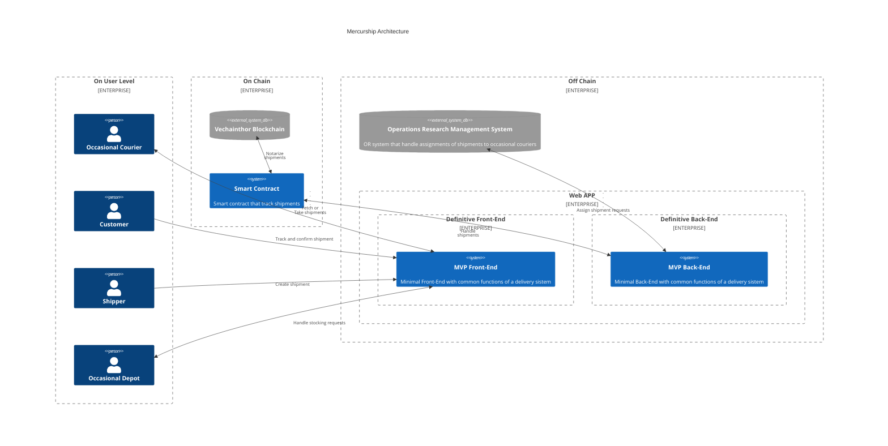
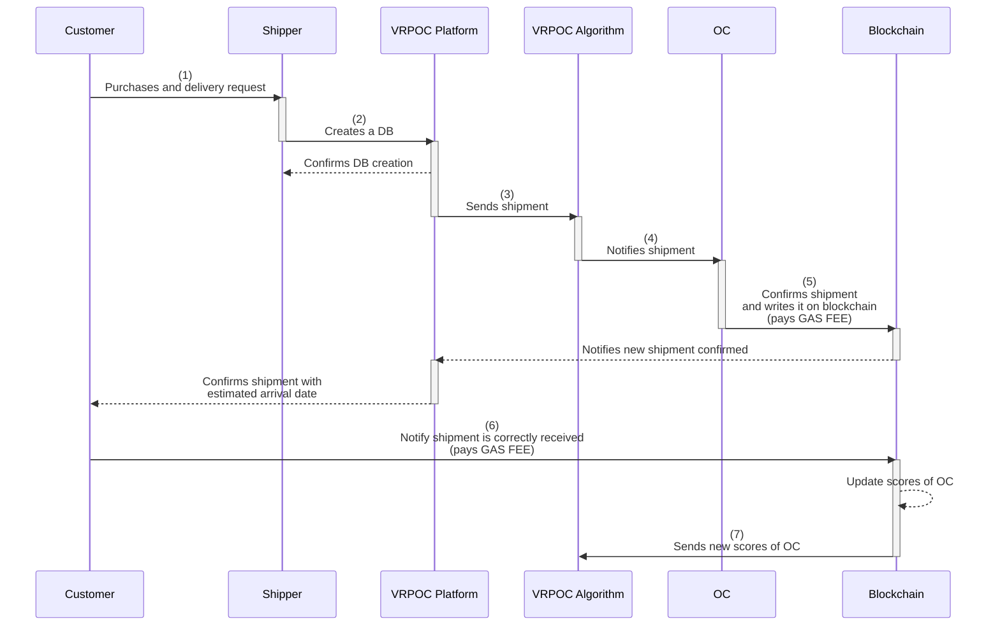
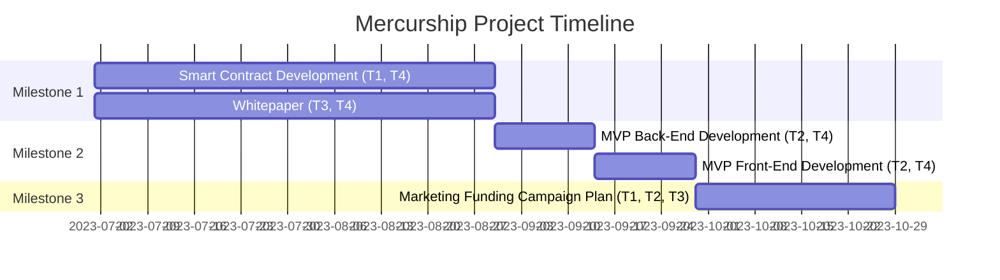

# Vechain General Grant Application Template

## Project Overview 

- **Project**: A smart contract for a blockchain-based system in the last-mile delivery
- **Team Name**: CratiChain LAB
- **Payment Address**: 0x75F4fb25852da7d6Ac63cc265995756C27D51DF4

### Overview

#### Description

The project aims, primarily, to develop and implement a smart contract for the management of Mercurship, an innovative way of carrying out shipments covering mainly the last-mile phase and using blockchain technology to certify deliveries. The main goal of Mercurship is to directly connect sellers with customers, incorporating an occasional courier system for deliveries. Every step of the system will be recorded on the Vechain blockchain, ensuring that each operation is certified in an immutable manner. This enables complete shipment traceability, enhancing the efficiency and security of the delivery process, and providing customers with greater transparency and reliability.

The market research conducted by the team has highlighted that the last-mile delivery sector is expected to grow to more than $200 billion from 108.2 between 2020 and 2027 ([Global last mile delivery market size 2020-2027 | Statista](https://www.statista.com/statistics/1286612/last-mile-delivery-market-size-worldwide/)). A positive sentiment toward the adoption of crowd-based solutions was found in the population and the rapid socio-economical changes that occurred during the last few years brought significant innovation challenges as shown by the birth of numerous successful start-ups operating in the logistics blueprint ([The future of the logistics industry](https://www.pwc.com/sg/en/publications/assets/future-of-the-logistics-industry.pdf)).

Additionally, the project also aims to produce a whitepaper to provide precise and clear information about the project, mockups, and MVPs for both the front-end and back-end.

#### Motivation of the project

1. We have chosen Vechain as our blockchain platform for several reasons.

   * **Low Gas Fees**. The cost-effectiveness of Vechain stands out among many other blockchain platforms. Vechain's low gas fees make it an attractive option for executing a multitude of transactions, which is crucial for the economic feasibility of our project.

   * **Industry-Focused Blockchain**. Vechain is widely recognized as a leading blockchain for industries. Its comprehensive ecosystem and the support it provides for industry-specific applications align perfectly with our project's goals.

   * **Partnership Advantage**. Being part of the team that carries out the grant, and being employed by Vechain, presents us with unique benefits. It allows us to be deeply involved in the technology, which, in turn, enables us to optimally program and execute our project.

   * **Useful Features**. Vechain offers several features that are highly beneficial for our project, one of which is fee delegation. This function allows a specific account (the sponsor) to pay transaction fees on behalf of another account (the user), which can greatly enhance the user experience and engagement in our project.

   * **Superior Performance**. Last but not least, in our paper, [SCITEPRESS](https://www.scitepress.org/PublicationsDetail.aspx?ID=nvsiy9Nth0I=&t=1), we conducted an experiment with three different blockchains (Ethereum, Polygon, and Vechain). Vechain showcased its efficiency and economic advantages.

Based on the points mentioned above, we believe that Vechain is the optimal platform for the Mercurship project. We are confident that, with Vechain's support, our project will achieve its intended objectives and contribute to the overall growth and success of the Vechain ecosystem.

2. We would also like to outline the potential for technical integrations with Vechain (and other tools) that can enhance the scope and effectiveness of our project.

   * **Fees Delegation**. We plan to fully implement the fee delegation feature offered by Vechain, which allows us to manage transaction fees in a streamlined manner. Our team will develop a platform for managing wallets, giving users the option to not handle private keys if they so choose. The fee delegation feature simplifies this process significantly.

   * **Tracking Chips for Parcels**. Mercurship's primary goal is to function as a shipping management system. This involves potentially utilizing specific NFC chips to enhance parcel traceability, as their unique codes will be stored on the blockchain alongside shipping data. The integration of this technology with Vechain's blockchain will provide a secure and transparent method of tracking, greatly increasing the efficiency and reliability of our shipping management.

   * **Revolutionary Power of "Phygitals"**. The concept of using NFC can also be applied to "phigitalization". By incorporating a particular NFC chip containing a "private key", we can strongly affirm the possession of a potential NFT that represents the object itself on the blockchain. This process presents a pioneering approach to blending the physical and digital realms, potentially revolutionizing how ownership and authentication are managed in the digital age.

In conclusion, we believe the integration of these innovative tools and features will substantially enhance the functionality and potential of the Mercurship project. We are excited to utilize the technological capabilities of Vechain and believe this partnership will pave the way for ground-breaking advancements in shipping management and digital ownership.

### Project Details

#### Overview of the technologies

We would like to provide an overview of the technologies we plan to use in the implementation of the overall Mercurship project.

1. **Smart Contract Development**. This aspect will be fully covered by the grant program. In particular, we will use Solidity for all on-chain management with Hardhat, thus providing us with a complete development stack encompassing testing, development, and more.

2. **MVP front-end Development**. The grant will partially cover the development of the project interface. The primary aim of the grant is to finance the development of the contract, intended as a shipping and certification system on the blockchain, with an additional interface developed in React/NextJS.

3. **MVP back-end Development**. Similar to the front-end, the back-end will be even more minimal and will have the basic functions necessary for the creation of an initial MVP. We will develop it using Django.

4. **Definitive Back-End and Front-End Development**. Not covered by the grant funding but to be developed in a later stage of the roadmap, the final back-end and Frond-end will be highly complex systems. They will be capable of interacting with Mercurship's innovative operations research algorithm and providing a comprehensive platform for occasional couriers and industries/shippers. Furthermore, they will simplify the management of the web3 part related to the Vechain blockchain, tracking of parcels, blockchain integrations, and much more. The technologies we plan to use in this system will include:

   * Golang for the back-end, chosen for its performance capabilities;

      * React/NextJS for front-end development (similar to MVP);

      * Vechain tools stack for blockchain integrations;

      * Payment systems, currently being decided;

      * Systems for trading parcels are currently being decided.

5. **Operations Research Management System**. Not covered by the grant funding, but to be developed in a later stage of the roadmap, this system will assign shipments to certain couriers based on scores representing their reliability, and on deviations from the original route, using an innovative operations research algorithm. The system will be developed in C and C++ to ensure performance and will be accessible via CLI/distributed event streaming platform/in-memory databases such as Apache Kafka and Redis.

#### Operation of the main components and architecture to be implemented

##### System Architecture Overview

The architecture of our project is split into two main systems: A1, which is directly funded by the grant, and A2, which represents the high-level architecture of the entire project.

###### A1: Grant-Funded Architecture
The architecture under this grant comprises three main components:

* **MVP Front-End**. The MVP front-end is a simple interface designed to manage a delivery system. It allows users to interact with the system and manage their delivery requests.

* **MVP Back-End**. This is the corresponding back-end for our MVP front-end. The MVP back-end provides the essential functionality to process and manage the deliveries that are handled by the front-end.

* **Smart Contract**. The Smart Contract is the core of our system. It's written in Solidity and is capable of managing the entire delivery process. This includes tracking and verifying deliveries to ensure they are properly certified on the blockchain.

These three elements work in tandem to form a generic-purpose delivery system that utilizes blockchain for order certification. While this system is generic in its current form, it serves as a vital subsystem within the larger scope of the entire project.

###### A2: Complete System Architecture

The complete system architecture is an expanded version of A1, designed to encompass the full range of the project's functionality.
This system includes:

**Definitive Back-End**. This advanced back-end system extends the capabilities of the MVP back-end, accommodating various aspects such as interactions with the Operations Research Management System, gamification mechanisms for occasional couriers, delivery support, blockchain integration functionalities, among other features.

**Definitive Front-End**. Like the definitive back-end, the definitive front-end expands upon the capabilities of the MVP front-end, providing a more comprehensive user interface that offers extensive functionality.

**Operations Research Management System**. This is the keystone of the whole project. It will be the result of in-depth research conducted by Edoardo Scalzo. This system offers an innovative and efficient method for assigning deliveries to occasional couriers. By considering numerous parameters, such as routes, vehicle types, package weight, etc., the algorithm provides the most efficient distribution of occasional couriers and packages for delivery.

**Smart Contract**. The Smart Contract is the same as the one developed under A1, serving as the heart of the system, and handling the overall delivery process.

The following image provides a visual summary of the complete architecture (A1 and A2).

Beside, to have a complete overview of system behavior, it is possible to see the below diagram.

* **OC** = Occasional Courier
* **VRPOC** = Vehicle Routing Problem with Occasional Couriers
* **DB** = Delivery Box (set of deliveries with related information)

#### Preliminary scientific research

This project is supported by preliminary scientific research published ([SCITEPRESS](https://www.scitepress.org/PublicationsDetail.aspx?ID=nvsiy9Nth0I=&t=1)) in the proceedings of the 12th International Conference on Operations Research and Enterprise Systems - ICORES 2023 by some members of our team.

The paper mathematically modeled a last-mile delivery system where the courier network consists solely of non-professional couriers, known as occasional couriers.
To make this network independent, the system does not involve any intermediaries or retailers to whom sellers entrust the products for retail management.

So, this scenario allows for a direct connection between sellers and final consumers.
Therefore, reliability, security, and certification problems would arise. To address this issue, we proposed, in the paper, to integrate this crowd shipping-based delivery system with blockchain technology.
With this research, we have answered the following questions: Is this system economically sustainable? Is it truly reliable?

We analyzed the economic benefits of this approach and presented experimental results from implementing the system on three different EVM-compatible blockchains. Our results show that the Vechain and Polygon blockchain systems offer good performance in terms of sustainability and although we have considered small-size instances, it would seem that they are promising for scalability. Overall, our analysis suggests that blockchain technology has the potential to revolutionize the last-mile delivery sector by offering greater transparency, security, and efficiency.

So, in conclusion, the main contributions of this research are:

1. Mathematical modeling of the described occasional courier system;

2. Validation of the model on test instances;

3. Integration of the delivery system with Vechain;

4. Computational analysis on the economic sustainability of the last-mile delivery system + blockchain.

### Ecosystem Fit

Concerning the logistic landscape, various crowd-based system solutions have been launched across the world, showing good market traction and adoption; Roadie and PigeonShip are significant examples in the United States, while Trunks is an established provider in the Netherlands.

From a supply chain perspective, Mercurship is a case of CPE business model (Couriers, Parcels and Express), covering mainly the last-mile phase of the delivery journey.

As shown in the [PwC Report](https://www.pwc.com/sg/en/publications/assets/future-of-the-logistics-industry.pdf), the logistics and transportation sector is confronting great changes: new technologies, new entrants, new customer expectations and new business models. In addition, customer expectations are increasing greatly, and both customers and businesses expect to get goods faster, more flexibly, and at lower costs while manufacturing is becoming more customized, putting stress on the logistics industry that is expected to deliver better results at lower prices.

In this dynamic environment, blockchain-based logistic solutions are among the most promising for their capacity to increase efficiency, reduce errors, and enhance security, while the involvement of the crowd permits increased flexibility while reducing costs and pollution.

Various start-ups are trying to offer solutions for the emerging challenges presented above, most of them in the last-mile phase of the delivery journey, where margins are higher and the market is even more dynamic and susceptible to fragmentation. This is the phase of the delivery journey where partnerships between established providers and new entrants with more flexible business models are exploited. Cases of collaboration between logistic service providers and local couriers are numerous, as are acquisitions of start-ups by established companies. Emerging trends such as the "physical internet" will probably make these cases even more frequent in the future.

Mercurship is a project that encompasses features capable of satisfying the increasingly challenging challenges of the sector and aims to be a good fit for the existing ecosystem, aiming to exploit trips that people make every day (in Italy, trips are valued at 99 million per day, of which 66% are made aboard a car) and providing storage solutions at lower costs. The service will be designed to be capable of interacting effectively with existing providers in order to create an effective solution for future partnerships or acquisitions.

At this moment, there is no other last-mile logistic solution that contains the same features as Mercurship, which is clearly distinguished for its superior UX, community-based approach, and blockchain-based platform capable of creating trust and guaranteeing the reliability of the shipment.

## Team 

### Team members

- Name of team leaders

   * **Rodolfo Pietro Calabrò**
   * **Edoardo Scalzo**

- Names of team members

   * **Federico Luigi Alfeo**
   * **Piero Bassa**
   * **Davide Giovanni Carrà**
   * **Federica Gaglianone**
   * **Domenico Lorenti**
   * **Vincenzo Tommaso Pugliese**
   * **Giuseppe Scarfò**

### Team Website

- https://cratichainlab.com/

### Team's experience

   * **Rodolfo Pietro Calabrò** is a Senior Blockchain Software Developer @Vechain with a deep interest in Computer Science since his early teens. His expertise lies in blockchain technologies, full stack software / web development, and research. He loves working on innovative projects and constantly updates his skills to keep up with new technology trends. His professional goals are continuous learning, fostering innovation, and maintaining a positive work attitude.

   * **Edoardo Scalzo** is a 29-year-old mathematician and researcher with a strong academic foundation. After earning a Master's degree in Mathematics in 2019, he went on to complete a Ph.D. in Operations Research in 2023. Edoardo's research focuses on logistics, last-mile transportation and delivery systems, middle-mile delivery systems, and green transportation, including their integration with blockchain technology. His expertise lies in designing, developing, and validating optimization models and algorithms, especially related to these topics. Alongside his academic pursuits, Edoardo has gained practical experience as an Applied Scientist at Amazon, specifically working with heuristics and metaheuristics within the logistics and transportation field. He is proficient in various programming languages, including Python, C++, Basic, and Java.

   * **Federico Luigi Alfeo** is a Full Stack Developer and Technical Leader specializing in numerous Blockchain projects, especially those related to data certification, sustainability, and assets trading. He manages the production release of a significant DLT project for the Italian banking system, which presently handles millions of transactions per second. Federico also partakes in pre-sales activities. In addition to his technical roles, he has broad interests in economics, history, art, and culture. Federico is dedicated to understanding the world, questioning the past, and envisioning the future.

   * **Piero Bassa** is a Senior Blockchain Software Developer @Vechain experienced in a broad array of technologies including Solidity, Hardhat, Python, React.js, and more. He has developed multiple high - impact projects and has extensive experience in Blockchain and Distributed Ledger Technology. Currently associated with the Vechain Foundation, Piero's strength lies in his comprehensive understanding of WEB 3 and Blockchain technology.

   * **Davide Giovanni Carrà** is a Software Developer with a special interest in blockchain and web3 technologies. His primary skills include blockchain technologies and full stack software / web development. Davide seeks to contribute to groundbreaking projects in the web3 space, revolutionizing industries and promoting blockchain adoption. His professional objectives focus on developing innovative decentralized applications and continuously expanding his expertise.

   * **Federica Gaglianone** is a passionate enthusiast of new technologies of art, Federica is a student at the Albertina Academy of Fine Arts in Turin. She is particularly fond of graphics, animation, and photography, using these mediums to add a philosophical touch to her work. Federica is highly skilled in visual arts, branding, and 2D animation, and is known for her determination to bring all her ideas to life.

   * **Domenico Lorenti** is skilled in a variety of technologies including Kubernetes, Docker, Java, C / C++, and more. As a determined student and computer science enthusiast, Domenico aims for professional growth and continuous learning. He has the ability to work both independently and as part of a team, and is currently focusing on learning new technologies for innovative solutions in the cloud field.

   * **Vincenzo Tommaso Pugliese** is a Business Engineer specializing in business planning, digital marketing, financial modelling, and managerial accounting. With a strong desire to add value to the world, he focuses on creating strategies to solve business and social problems. His extensive experience in various fields has helped him develop a comprehensive understanding of business topics. Vincenzo is always looking to learn new things and make a positive impact, both professionally and personally.

   * **Giuseppe Scarfò** is a Senior Blockchain Software Engineer @DVRS, passionate about computer science and technology since childhood. He has a strong interest in blockchain technology, stemming from his discovery of Bitcoin and the PoW protocol in 2016. Giuseppe's dedication to his field is apparent in his constant pursuit of knowledge and his desire to make an impact in the world through technology.

### Team Code Repos

   * Rodolfo Pietro Calabrò https://github.com/rodolfopietro97
   * Edoardo Scalzo http://github.com/K1m0sab3
   * Federico Luigi Alfeo https://github.com/Valazan
   * Piero Bassa https://github.com/pierobassa
   * Davide Giovanni Carrà https://github.com/DavideCarra
   * Domenico Lorenti https://github.com/domenicolorenti
   * Giuseppe Scarfò https://github.com/hartick

### Team LinkedIn Profiles

   * Rodolfo Pietro Calabrò https://www.linkedin.com/in/rodolfo-pietro-calabr%C3%B2-5a9576171/
   * Edoardo Scalzo https://www.linkedin.com/in/edoardo-scalzo
   * Federico Luigi Alfeo https://www.linkedin.com/in/federico-luigi-alfeo-0048a0133/
   * Piero Bassa https://www.linkedin.com/in/pierobassa/
   * Davide Giovanni Carrà https://www.linkedin.com/in/davide-giovanni-carr%C3%A0-8948b5276/
   * Federica Gaglianone https://www.linkedin.com/in/federica-g-7940b4208/
   * Domenico Lorenti https://www.linkedin.com/in/domenico-lorenti-786546221
   * Vincenzo Tommaso Pugliese https://www.linkedin.com/in/vincenzo-tommaso-pugliese-a30b2718b/
   * Giuseppe Scarfò https://www.linkedin.com/in/giuseppescarfo/

## Development Roadmap 

### Team allocation

* **T1 - Smart Contract Development**
   * Rodolfo Pietro Calabrò
   * Piero Bassa
   * Giuseppe Scarfò
   * Federico Luigi Alfeo

* **T2 - Front-End and Back-End Development**
   * Edoardo Scalzo
   * Piero Bassa
   * Federica Gaglianone
   * Domenico Lorenti
   * Davide Giovanni Carrà

* **T3 - Whitepaper Development**
   * Federico Luigi Alfeo
   * Federica Gaglianone
   * Vincenzo Tommaso Pugliese

* **T4 - Project Management & Research**
   * Rodolfo Pietro Calabrò
   * Edoardo Scalzo
   * Vincenzo Tommaso Pugliese

### Overview

|  | **Milestone 1** | **Milestone 2** | **Milestone 3** | **Total** |
|---|---|---|---|---|
| **Estimated Duration** | 2 months | 1 month | 1 month | 4 months |
| **Goal** | To have a generic and functioning smart contract. | To have an MVP back-end and front-end that interact with the contract, providing a viable and usable minimum viable product. | To launch a marketing campaign and gather feedback, mainly by modifying the front-end and back-end based on this feedback and exploring possible new use cases. |  |
| **Team Involved** | T1, T3, and T4 | T2 and T4 | T1, T2, and T3 |  |
| **FTE** | 4 | 2.5 | 4.5 | 11 |
| **Cost** | 15000$ | 10000$ | 5000$ | 30000$ |

### Milestones

#### Milestone 1 - Smart Contract Creation and Whitepaper Development

| **Number** | **Deliverable** | **Specification** |
|---|---|---|
| **1.1** | Whitepaper | A document providing clear, effective, and succinct information about the project. Mockup of the main UI components. |
| **1.2** | Smart Contract | A full Solidity smart contract capable of managing shipments from all aspects - from shipping to confirmation of arrival, through a system of signatures. |

#### Milestone 2 - MVP Front-End and Back-End Creation

| **Number** | **Deliverable** | **Specification** |
|---|---|---|
| **2.1** | MVP Front-End | A very basic NextJS Front-End that allows a user to manage shipments and interact with the smart contract. |
| **2.2** | MVP Back-End | A Django Back-End allowing the management of shipments (shipper/courier side), primarily as a dashboard that interacts with the smart contract and updates subsequent to shipments and blockchain data. |

#### Milestone 3 - Marketing

| **Number** | **Deliverable** | **Specification** |
|---|---|---|
| **3.1** | Marketing Funding Campaign Plan | Planning and implementing an effective campaign to secure additional funds for the project. Communication plan, MVP for validation purposes, and promotional materials. |

### Work Breakdown

* **Milestone 1**. Smart Contract (T1, T4) in parallel with Whitepaper (T3, T4)

* **Milestone 2**. Back-End (T2, T4) in the first two weeks followed by Front-End (T2, T4) in the last two weeks

* **Milestone 3**. Marketing Campaign and Software Refinements (T1, T2, T3)

The following figure represents a simple Gantt chart using Mermaid to visualize the project timeline.

**NOTE**: In this GANTT, developments are assumed to begin on July 01.

#### Community engagement

##### Extend the scientific research and produce another paper to be published in an internationally recognized journal

We have a comprehensive plan in place to conduct thorough scientific research aimed at testing and validating the system outlined in the Project Details (**Preliminary scientific research** section). This research will involve real or realistic large-scale instances, allowing us to evaluate the system's performance under practical conditions. We will utilize the smart contract specifically developed for this grant to facilitate the research process.

Building upon the results and conclusions from our previous published research, we have recognized the need to further enhance the last-mile delivery system. To achieve this, our team will focus on designing and implementing a sophisticated algorithm that effectively and efficiently manages the interaction between the delivery process and the Vechain blockchain.

Additionally, we plan to present the results of our research at renowned international conferences and seek peer-reviewed publication in respected journals. Disseminating our work within the scientific community will foster knowledge exchange, generate valuable feedback, and contribute to the advancement of integrating the Vechain blockchain in new contexts, such as last-mile deliveries.

In the current state of art this is our publication:

* [SCITEPRESS](https://www.scitepress.org/PublicationsDetail.aspx?ID=nvsiy9Nth0I=&t=1)

## Future Plans

### Business Model

As previously presented in the "project overview" section, the work that will be carried out with the grant is a part of a comprehensive project concerning the development of an innovative system for crowd-based last-mile logistics realized by applying a blockchain-based solution to a network of businesses, storage, occasional couriers, and consumers. This type of application, as shown in the conducted market research, shows good sentiment among the population, whose main concern is the reliability of the involved actors, in this case guaranteed by the blockchain. The revenue model of the business is mainly transaction-based: for each transaction executed on the platform, Mercurship will charge a percentage fee (15%) on the shipment and storage prices;

It will also be possible for the users to buy in the app both proprietary tokens and services or products provided by partnered companies with an affiliate model. The platform will have a superior user experience, be developed to be highly engaging, and create a strong sense of community among the members on the topics of sustainability, social utility, and technology. All the work will be carried out using a lean approach based on continuous validation that involves focus groups and testing to launch the best marketable solution. 270.000€ has been esteemed as the total budget required to complete the project and launch the idea on the market. The sum covered the following aspects:

* **Product**: 180.000€;
* **Intellectual properties**: 10.000€;
* **Start-Up costs**: 25.000€;
* **Marketing**: 50.000€.

The financial model shows that Mercurship is a project capable of generating elevated cash flows with a flexible cost structure and margins in line with the CEP companies in the sector. It’s important to underline that the following statements have been created using conservative expectations for the revenue drivers and a precautionary approach for what concerns budget allocations. The forecast covers the first three years of activity for the project, which in this model is expected to be carried out in Italy.

The forecast income statement is shown below.

|  | **YEAR I** | **YEAR II** | **YEAR III** | **YEAR I** | **YEAR II** | **YEAR III** |
|---|---|---|---|---|---|---|
| **Total Revenue** | **2253651** | **5145842** | **8366305** | **100.00%** | **100.00%** | **100.00%** |
|  |  |  |  |  |  |  |
| **Variable costs** | **1990875** | **4555999** | **7410312** | **88.34%** | **88.54%** | **88.57%** |
| Direct labour | 1900728 | 4350166 | 7075659 | 84.34% | 84.54% | 84.57% |
| Payment fee | 67610 | 154375 | 250989 | 3.00% | 3.00% | 3.00% |
| blockchain fee | 22537 | 51458 | 83663 | 1.00% | 1.00% | 1.00% |
| API | 4000 | 8000 | 12000 |  |  |  |
|  |  |  |  |  |  |  |
| **Gross margin** | **262777** | **589843** | **955994** | **11.66%** | **11.46%** | **11.43%** |
|  |  |  |  |  |  |  |
| **Fixed cost** | **227000** | **378000** | **478000** | **10.07%** | **7.35%** | **5.71%** |
| Marketing | 75000 | 160000 | 240000 | 3.33% | 3.11% | 2.87% |
| Commercial labour | 45000 | 60000 | 80000 | 2.00% | 1.17% | 0.96% |
| Events | 0 | 0 | 0 | 0.00% | 0.00% | 0.00% |
| Technical labour | 40000 | 40000 | 40000 | 1.77% | 0.78% | 0.48% |
| External consulting | 12000 | 60000 | 60000 | 0.53% | 1.17% | 0.72% |
| Rent | 8000 | 8000 | 8000 | 0.35% | 0.16% | 0.10% |
| Manteinance | 6000 | 6000 | 6000 | 0.27% | 0.12% | 0.07% |
| Administration labor | 24000 | 24000 | 24000 | 1.06% | 0.47% | 0.29% |
| Utencies | 8000 | 8000 | 8000 | 0.35% | 0.16% | 0.10% |
|  |  |  |  |  |  |  |
| **EBITDA** | 35777 | 211843 | 477994 | 1.59% | 4.12% | 5.71% |
| TFR | 6758 | 7688 | 8928 | 0.30% | 0.15% | 0.11% |
| Depreciation | 99056 | 99056 | 9056 | 4.40% | 1.92% | 0.11% |
| Amortized loss | 0 | -70037 | 0 | 0.00% | -1.36% | 0.00% |
| **EBIT** | -70037 | 35061 | 460010 | -3.11% | 0.68% | 5.50% |
|  |  |  |  |  |  |  |
| **Tax** | 0 | 12048 | 110402 | 0.00% | 0.23% | 1.32% |
|  |  |  |  |  |  |  |
| **NET INCOME** | -70037 | 23014 | 349607 | -3.11% | 0.45% | 4.18% |

The following graph represents the cumulative cash flow over a three-years period. During the last four quarters, a cash accumulation is forecast in order to face a new funding round and to extend the range of the business at an international level in other European countries.

A synthetic version of the balance sheet is provided to show the compositions of the asset side, where intangibles include software, IP, and start-up costs, and the liability side.

|  | **YEAR 0** | **YEAR I** | **YEAR II** | **YEAR III** |
|---|---|---|---|---|
| **TOTAL ASSETS** | **270000** | **206721** | **307460** | **665995** |
| Intangibles | 232500 | 133444 | 34388 | 25332 |
| Cash | 37500 | 73277 | 273072 | 640663 |
|  |  |  |  |  |
| **LIABILITIES + EQUITY** | **270000** | **206721** | **307460** | **665995** |
| Shareholders equity | 270000 | 270000 | 270000 | 270000 |
| Profit or loss reserve |  | -70037 | 23014 | 372621 |
| TFR |  | 6758 | 14446 | 23374 |

### The possibility to integrate the smart contract of this project into any type of supply chain system

For the integration, the following steps can be considered:

* Define the specific conditions and requirements for the various stages of the supply chain. These may include confirmation of receipt by the various actors in the system, updating the delivery status in the tracking system, and potentially verifying service quality.
* Extend the smart contract to include the rules, functions, and logic necessary for managing the initial part of the supply chain.
* Connect the smart contract to the supply chain management system so that it can interact with other stages and components of the process. This may involve using APIs or communication protocols to enable the exchange of information between the smart contract and other actors in the supply chain system.
* Test and validate the smart contract through simulations and real-life scenarios to ensure that it functions properly and meets the needs of the entire system.
