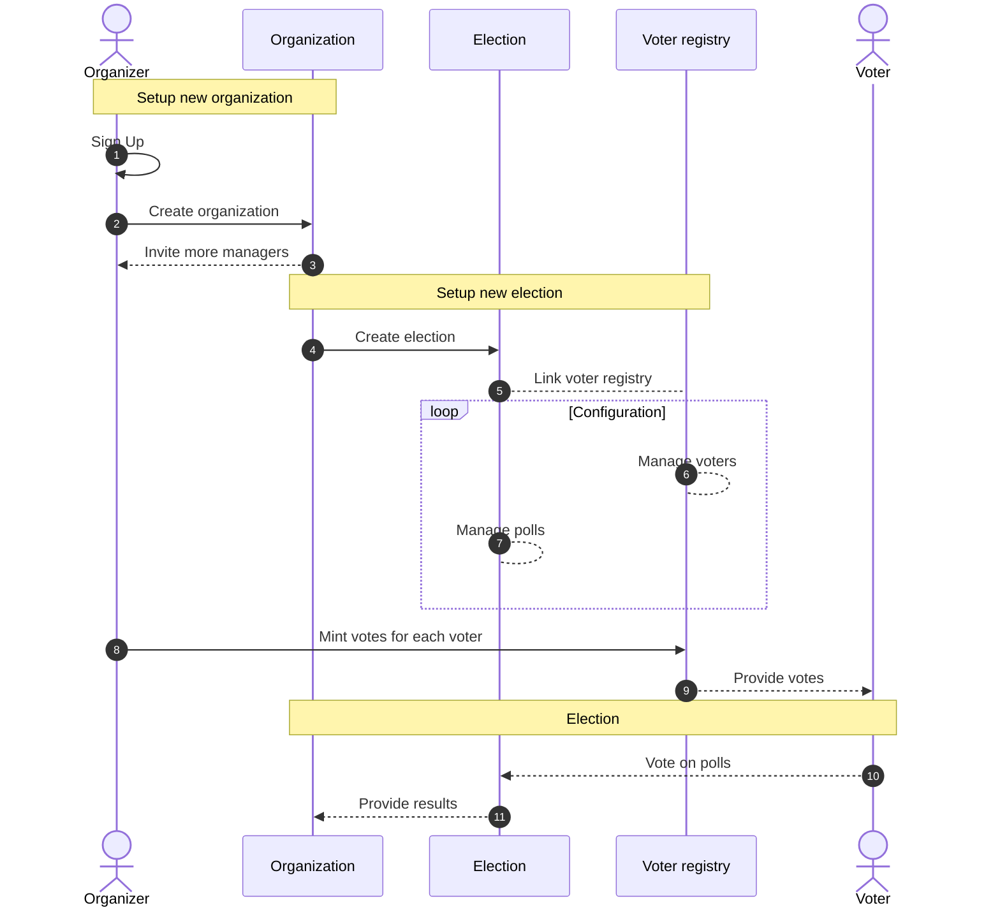
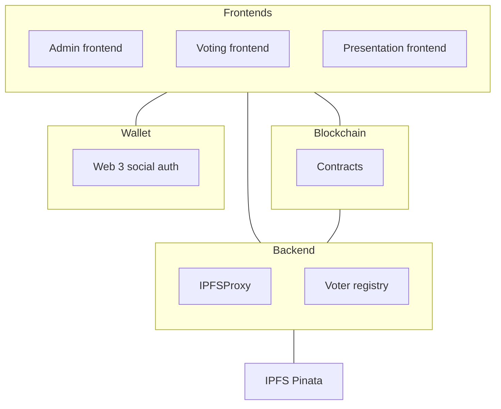

# VeChain General Grant Application

## Project Overview 

- Project: VOTEOS
- Team Name: HPM GmbH
- Payment Address USDT: 0xd450dabfb20cd5294c76eea0ec80c3ca34c3437a

### Overview

VOTEOS is an audit-proof voting solution aimed at corporate users.

Management boards and other decision-making bodies usually have to vote on decisions at regular intervals. The requirements for the formal procedures of those meetings are regulated by law.

In the wake of the still ongoing pandemic situation, the demand for a digital solution for voting processes has increased rapidly. Even though the legal requirements have been reduced somewhat, the challenge remains to have a digital and remote voting process which adheres to law from start to finish.

VOTEOS aims to be an all in one platform for digital voting. Starting with the registration and ending with election results, the whole process happens digitally on the blockchain.  
  
VeChain was chosen due to the fee delegation feature, as it allows us to provide our service to customers without prior blockchain experience.

### Project Details

Everything relevant to the voting process is stored and managed by smart contracts. Private data is encrypted and saved in IPFS and can only be accessed by organization members.

**What does it solve?**

Currently, there is no legally secure method for digital voting.

With the help of blockchain technology, votes and election processes can be mapped in an audit-proof manner.  
  
This leads to the core features:

- Revision security
- No registration requirement for voters, easy on-boarding for voting
- Data protection compliant
- Real-time evaluation
- Transfer of votes
- Simple administration and payment
- Privacy protection law compliant

**Who will use it?**

The Audience includes all groups that, for reasons of civil or commercial law, are required to perform and document legally compliant votings.

**Where can I use it?**

The most common use cases are:

- Bringing about solutions to amend bylaws and contracts.
- Election of supervisory boards, management boards and other positions
- Discharge of management or board of directors 
- Voting on motions from the auditorium.
- Elections at owners' meetings
- etc.

**Infrastructure in a Nutshell**

Technically contracts will be deployed for each election and votes will be minted as NFT. Using the NFT standard allows potential integration with other wallets/applications/platforms. Tokens can be shared and used for voting. All metadata is stored on IPFS, with a on-the-fly-encryption within a custom ipfs proxy that enforces access control managed in smart contracts.

IPFS Proxy and Website-UIs are hosted on AWS. Providing an IPFS or distributed version is planned for the future.

#### Organizer Application flow

#### Vote provision flow

#### Application Screens

**Admin dashboard to organize votes**   

* 
  
**Create a question**

* 
  
**Manage the agenda**

* 
  
**Add voters**

* 
  
**Create votes**

* 
  
**Election moderation**

* 
  
**Join election on mobile**

* 

**Vote on mobile**

* 

**Results on mobile**

**Presentation view**

* 

#### Tech-stack

The UI is built using React. Backend-Services to provide encrypted IPFS data are built using NodeJS. Pinata is used to support storage on IPFS.

* Frontends
   * Admin, Voter and Presentation
   * Ant Design Components
* Wallet
   * toruslabs/openlogin
   * social login
* Backend
   * IPFSproxy for Pinata
      * used for metadata and file storage
      * to encrypt end decrypt private data
   * NodeJS Backend
   * hapi framework
* Blockchain
   * Contracts
   * Hardhat development environment

## Access control

### Ecosystem Fit

- It is an ecosystem enrichment as it is the first of its kind
- This project generates attention from corporate customers for VeChain
- We introduce _users unfamiliar with blockchain technology_ to the ecosystem

## Team 

### Team members

- 8 Team members of HPM GmbH

### Team Website

- https://hpm.agency/
- https://admin.voteos.com/  (Preview-Version)
- https://voteos.com (Preview-Website, currently german only)

### Team's experience

Our whole team is currently 15 members strong and is building enterprise applications for more than 20 years. Building custom solutions for enterprises and re-useable products is our daily business.

### Team Code Repos

- No public code repositories available
- Access to private repositories and more detailed documentation can be granted under NDA

## Development Roadmap 
#### Overview

|                                  | Auth-Workflow | Election Administration | Voter Administration & Vote Distribution | Voting & Results | Payment |         |
|----------------------------------|---------------|-------------------------|------------------------------------------|------------------|---------|---------|
| Duration                         | 2             | 8                       | 8                                        | 9                | 4       | 33      |
| Full-time equivalent (FTE)       | 1             | 2                       | 2                                        | 2                | 4       | 11      |
| Cost                             | $880          | $7.040                  | $7.040                                   | $7.920           | $7.040  | $29.920 |

Based on a $440 / daily rate. $1200 is the normal rate which is covered by HPM.

#### Milestone 1 Auth-Workflow & Setup

| Number | Deliverable                                    | Specification                                                                          |
|--------|------------------------------------------------|----------------------------------------------------------------------------------------|
| 1      | Redirect to admin frontend after Login         | Auth-Workflow: sign up/-in with web3auth for hosted wallets                            |
| 1.1    | Wallet can be used to interact with blockchain | Integrate service: Web3auth toruslabs/openlogin for passwordless login                 |
| 1.2    | Unit tests proving JWKS functionality          | Session Micro-Service: create micro-service for session handling and access protection |

- The deliverables will be proven by unit tests, screenshots and a link to a website

#### Milestone 2 Election Administration

| Number | Deliverable                                      | Specification                                                                                |
|--------|--------------------------------------------------|----------------------------------------------------------------------------------------------|
| 2      | Functional admin frontend                        | Election administration                                                                      |
| 2.1    | Organization contract deployment and interaction | Organization management: create and edit organizations in admin frontend                     |
| 2.1.1  | Organization contract rights management          | Membership management: manage organization members, member invite & join                     |
| 2.1.2  | Visualization of blockchain events               | Audit log: organization audit log using blockchain events                                    |
| 2.2    | Election contract deployment and interaction     | Election management: create and manage elections in admin frontend, including live execution |
| 2.2.1  | Attachments can be added to election and persist | Attachment handling: allow adding file attachments hosted in IPFS                            |
| 2.3    | Frontend interaction with election contract      | Poll management: create and manage questions                                                 |
| 2.3.1  | Frontend interaction with election contract      | Answer management: create and manage answers                                                 |

- The deliverables will be proven by unit tests and screenshots

#### Milestone 3 Voter Administration & Vote Distribution

| Number | Deliverable                                  | Specification                                                                                                         |
|--------|----------------------------------------------|-----------------------------------------------------------------------------------------------------------------------|
| 3      | Administration frontend                      | Voter administration & Vote distribution                                                                              |
| 3.1    | Voter registry encryption backend            | Voter registry: create voter registry for potential voter with encrypted data only accessible to organization members |
| 3.2    | NFT minting by election contract interaction | Vote distribution: ERC-721 NFT vote minting and distribution, CSV download of created votes                           |

- The deliverables will be proven by hardhat jest unit tests results and screenshots.

#### Milestone 4 Voting & Results

| Number | Deliverable                                    | Specification                                                                                                                                             |
|--------|------------------------------------------------|-----------------------------------------------------------------------------------------------------------------------------------------------------------|
| 4      | Functional voting Frontend                     | Voting & Results                                                                                                                                          |
| 4.1    | NFT owners can vote on election contract poll  | Join event and vote: voting frontend, join an election by link, vote on active polls                                                                      |
| 4.1.1  | Frontend interaction with encrypted ipfs data  | Private data: access private data with an ipfs proxy that encrypts/decrypts on the fly with access validation for the smart contract organization members |
| 4.1.2  | Token ownership transfer and multi token vote  | Vote sharing: ability to share votes (tokens) and cast (multiple) votes for other users                                                                   |
| 4.2    | Live result display in frontends               | Results: display results to all parties                                                                                                                   |
| 4.3    | Dedicated result presentation frontend         | Presentation view: read only presentation view for broadcasting (optimized for crowd viewing)                                                             |

- The deliverables will be proven by unit tests, screenshots and a link to a website

#### Milestone 5 Payment

| Number | Deliverable                                                      | Specification                                            |
|--------|------------------------------------------------------------------|----------------------------------------------------------|
| 5      | Functional payment service integration                           | Payment                                                  |
| 5.1    | Successful payment adds ballots to organization                  | Service integration: implement Stripe as payment provider|
| 5.2    | Payment history is saved and accessible in organization contract | History: organization purchase history                   |
| 5.3    | Organization contract ballotBalance can be changed by admin role | Refund: ballot refund administration                     |

- The deliverables will be proven by unit tests and screenshots.

#### Community engagement and marketing

Our main marketing statement consists of creating and running audit-proof elections in a simple and uncomplicated workflow - _"as easy as sending a text message"_.   
In order to create brand awareness for VOTEOS and VeChain we are planning to run marketing campaigns on social media and business networks.   
Additionally articles on the conduct of various types of elections will be published to digital platforms like [Medium.com](https://medium.com/).   
By giving away free packages of votes, we can lower the entry barrier to our service.  
Our initial sales strategy will be to acquire users through direct marketing in the founder's personal business network of entrepreneurs and employees in management positions.  
A _Runs on VeChain_ Link will be included in the footer of our web applications.

## Future Plans
Our goal is to create a digital voting solution for associations and companies. Our premise is to allow anyone to simply create and conduct audit proof elections at a reasonable cost. 
We will keep on developing features and optimizations to establish blockchain voting in the target group.

### Planned features include
- Voting weights
- Poll templates / export + import
- Performance and cost monitoring
- Vote burning
- Result export

## Business Model

Billing is based on the "pay per use" principle. Each ballot costs a certain amount. Ballots are bought by organizers for organizations.

- [Stripe.com](https://stripe.com/) is used as payment service provider
- Sale of ballots
  
| Ballot range | cost/ballot |
| ------ | ------ |
| Up to 100 | 2€ |
| 101 - 500 | 1,50€ |
| 501 and above | 1€ |

## Additional Information 

* To this day we have already managed to carry out a prototype election together with the `Initiative Deutsche Zahlungssysteme`
* We do not intend to open source our code
* HPM GmbH funds the development out of its own resources right now
* We have not applied to any other grants
  
