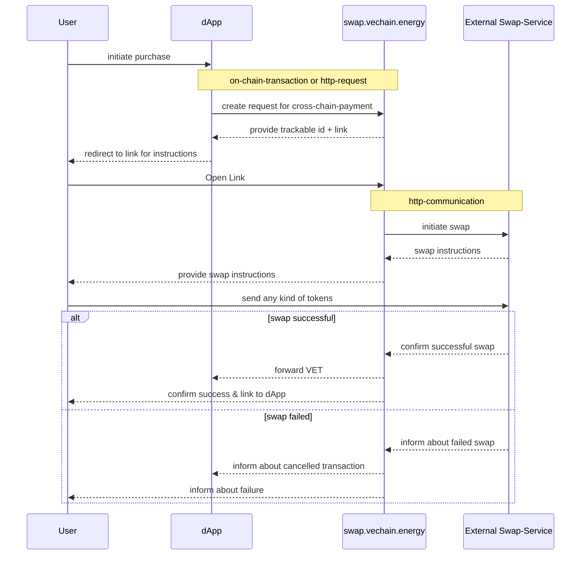
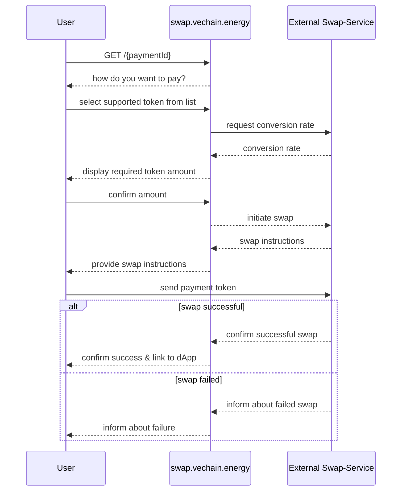
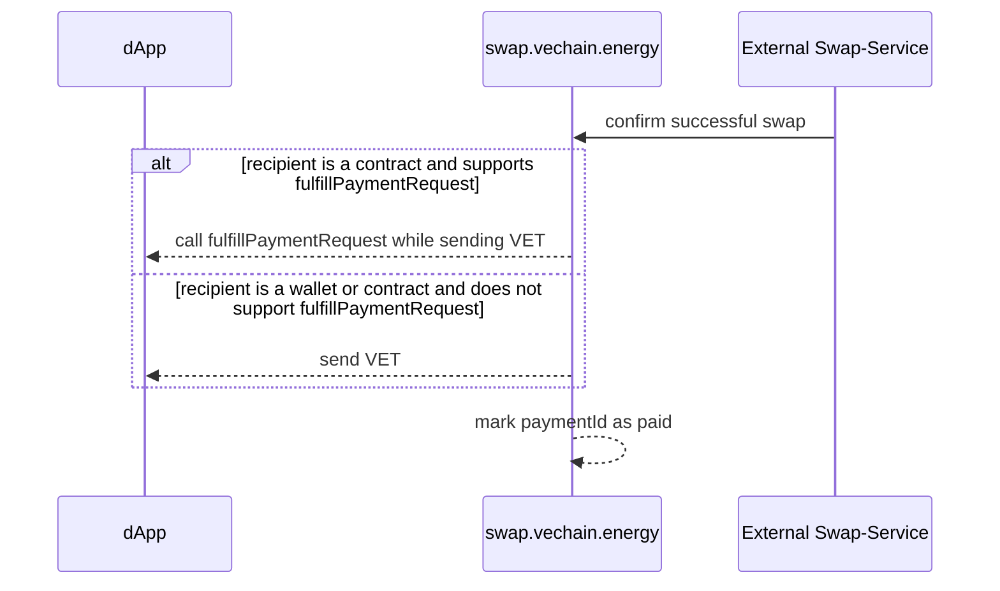

# VeChain General Grant Application Template

## Project Overview 

- Project: Cross-Chain-Token-Payment-Gateway
- Team Name: favo
- Payment Address: `0xcC4B3412161Ea88d0538D2Da15cffa74af0eE9D4`

### Overview

The Payment-Gateway provides the ability to use cross-chain-tokens in Vechain contracts and dApps.

Example use-cases are:
- NFTs can be purchased with native ETH on a marketplace
- dApps can accept payments in many supported tokens

The Gateway will provide a standardized process that can be implemented in dApps and contracts. Tokens are automatically swapped to native VET using an established cross-chain-swap service.

### Project Details

**Swap-Process**



#### Swap Initiation

A dApp can initiate a payment request for an expected VET amount by a contract call. An example contract call is:

```solidity
swapContract.createPaymentRequest(bytes32 paymentId, uint256 vetPrice, address recipientAddress)
```

- It creates an on-chain-documentation of the payment request that can be tracked using the given `paymentId`.
- The `paymentId` must be generated by the initiating dApp and must be unique or it will revert.

As an alternative an API endpoint is made available that can be used to initiate a payment request. The API endpoint example is:

```http
POST https://swap.vechain.energy/api/initiate

{
  "paymentId": "0x…",
  "vetPrice": 1000000000000000000,
  "recipientAddress": "0x…"
}
```

It will return a transaction id for the documented payment request and a link for redirecting the user to the swap-website. An example response is:

```json
{
  "txId": "0x…",
  "url": "https://swap.vechain.energy/{paymentId}"
}
```

If the recipient is meant to be a contract, then the contract can implement an interface to get additional information about the payment request. An example interface is:

```solidity
import "IVENPayments.sol";
address private swapContractAddress;

// ensure payment requests are only handled once
mapping(bytes32 => bool) private s_handledPaymentIds;

// receive VET and paymentId at the same time
function fulfillPaymentRequest(bytes32 paymentId) external payable {

  // prevent double handling
  require(!s_handledPaymentIds[paymentId], "payment already handled");

  // ensure payment request was created by swapContract and was successful
  bool success = IVENPayments(swapContractAddress).isSuccessful(paymentId);

  // document that the paymentId was already handled
  s_handledPaymentIds[paymentId] = true;

  // continue with other tasks…
}
```

#### Swap-Tracking

The `swapContract` will track the payment request and its result. The following functions are available:

- `isSuccessful(paymentId) returns (bool)` true/false for successfully completed payments
- `isPaymentRequest(paymentId) returns (bool)` true/false for existing payment requests
- `paymentRecipient(paymentId) returns (address)` the recipient address
- `paymentVetPrice(paymentId) returns (uint256)` the expected VET amount
- `paymentCreatedAt(paymentId) returns (uint256)` the block number of the payment request creation
- `paymentCompletedAt(paymentId) returns (uint256)` the block number of the payment request completion

The same information is available via an API, with additional information about the swap:

```ts
GET https://swap.vechain.energy/api/{paymentId}

{
  "paymentId": string
  "vetPrice": number
  "recipientAddress": string
  "createdAt": number
  "completedAt": number
  "success": boolean
  "status": "created" | "exchanging" | "sending" | "completed"
}
```

| Status | Description |
|-|-|
| created | The payment request was created and is waiting for a user deposit |
| exchanging | A deposit was received and is being processed |
| sending | The VET is being sent to the recipient |
| completed | The payment request was completed |


#### Swap Execution

- The user is redirected by the dApp to `https://swap.vechain.energy/{paymentId}` in either a new window/tab, a modal or embedded in the dApp website.
- When the user selects the payment token, then the conversion rate is calculated and presented.
- When the user confirms the token for payment, then a swap is initiated at a third party and the user is prompted to send the payment token to the swap-provider.

Once the swap is completed and the VET arrived on Vechain, the swap will be finalized.




#### Swap Finalization

- When the VET has arrived at the `swapContract` and the swap-provider confirms the conversion with a transaction id,
- then the swap will be finalized in a transaction, initiated by swap.vechain.energy
- and the request payment amount is sent to the recipient address by the `swapContract`.




### Ecosystem Fit

A payment swap for cross-chain-tokens will provide liquidity to all Vechain dApps. dApps can attract users from other blockchains and Vechain will attract more capital.


## Team 

### Team members

- I am a fulltime IT-professional for 24 years with focus web- and mobile applications, I ran two companies and during covid decided to switch fully into web3. I am happy to share more details by email (instead of publishing it on GitHub).

### Team Website

- https://vechain.energy

### Team's experience

* https://vechain.energy demonstrates the core experience and the surrounding services/products, provide evidence about the ability to create this project.

## Development Roadmap 

#### Overview

|  | Contract | Backend | Website | Total |
| - | -: | -: | -: | -: |
| Estimated Duration | 8d | 12d | 15d | 35d |
| Full-time equivalent (FTE) | 1 | 1 | 1 | 1 |
| Cost (up to $ 30,000) | $6,400 | $9,600 | $12,000 | $28,000 |


#### Milestone 1 — Contract

| Number | Deliverable | Specification |
|-|-|-|
| 1.0 | Setup | Setup Project including a CI/CD-Pipeline with Unit-Tests |
| 1.1 | Payment-Initializer | Ability to initiate a new payment request |
| 1.2 | Payment-Finalizer | Ability to finalize a payment and forward the payment |
| 1.3 | Example-Snippets | Write examples and documentation for other developers to implement the interface for contract interaction |

* Deliverables will be proven by hardhat unit tests and a Markdown-Document with Code-Snippets.

#### Milestone 2 — Backend

| Number | Deliverable | Specification |
|-|-|-|
| 2.0 | Setup | Setup Project including a CI/CD-Pipeline that auto-deploys |
| 2.1 | Contract-Connectivity | Interaction with `swapContract` from an authorized role |
| 2.2 | Token-Selection | Provide a list of supported tokens |
| 2.3 | Conversion | Provide a conversion rate for a payment for a given token |
| 2.4 | Swap-Initialization | Initiate swap with Swap-Provider |
| 2.5 | Swap-Tracking | Receive swap updates and ability to track status on-demand |
| 2.6 | Swap-Finalization | Pass completed swaps to `swapContract` for further handling |
| 2.7 | Swap-API | API to initiate a payment request and receives its current status |

* Deliverables will be proven by unit tests.

#### Milestone 3 — Website

| Number | Deliverable | Specification |
|-|-|-|
| 3.0 | Setup | Setup Project including a CI/CD-Pipeline that auto-deploys |
| 3.1 | Payment-Status | Display a payment status based on a `paymentId` (status/sucess/error) |
| 3.2 | Token-Selection | Allow user to select a supported token for payment |
| 3.3 | Confirmation | User confirms conversation rate based on a selected token |
| 3.4 | Swap-Progress | Display status of the swap with as many details as possible in a human digestable way |

* Included in this milestones are tests with community members and projects. This feedback will be used to improve the website and the service before launch.
* The website related deliverables will be proven by a link to the website and screenshots
* The application will be deployed on AWS using lambda, s3 and cloudfront as a serverless infrastructure.

#### Community engagement

* An article about the service and/or a tutorial on how to use it will be published on Medium.
* Support for interested dApps will be provided via discord.

## Future Plans

After the initial Milestones on this roadmap the development will be shaped by the feedback from its users and experience acquired during development. The project will be self-financing through a small fee charged during the swaps.

## Additional Information 

A production ready prototype is already being developed and tested. I received grants for the development of vechain.energy.
