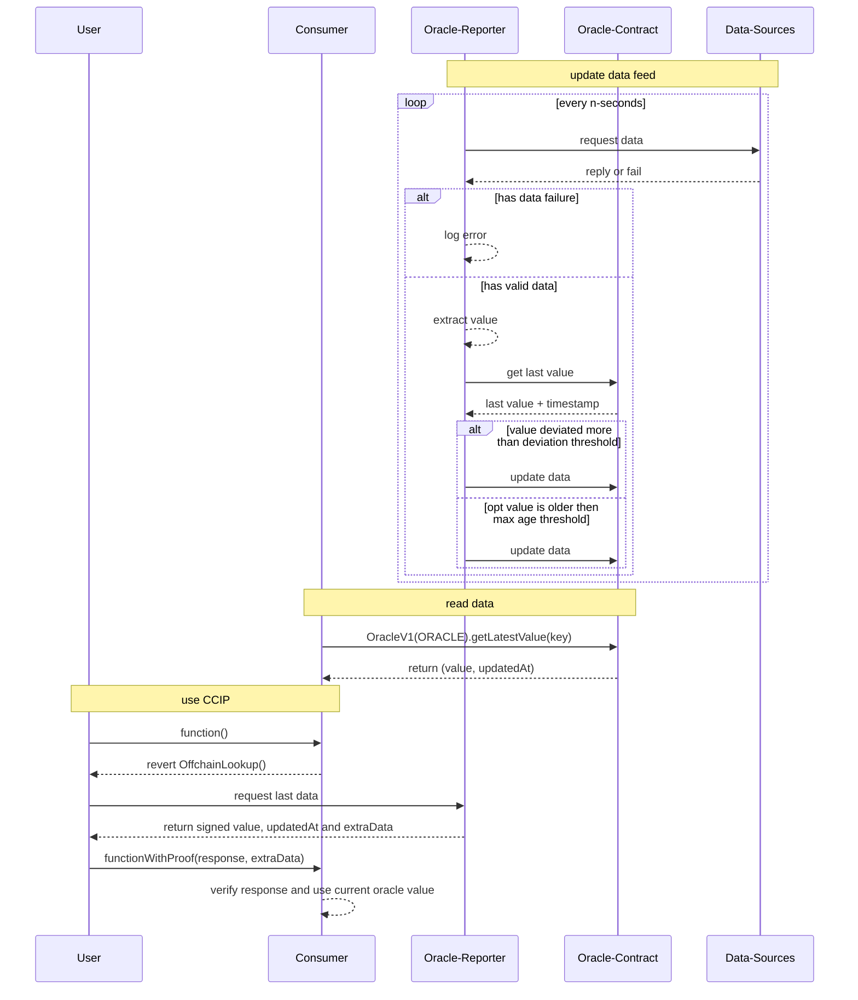

# VeChain General Grant Application Template

## Project Overview 

- Project: Oracle for VET/USD + VTHO/USD Pricing
- Team Name: favo
- Payment Address: `0xcC4B3412161Ea88d0538D2Da15cffa74af0eE9D4`

### Overview

This project aims to bring VET/USD and VTHO/USD price to Vechain, enabling everyone to utilize fiat pricing in their dApps.

A data feed publishing VET/USD, VTHO/USD, and EURT/USD will provide fiat information in an on-chain contract.

All components will be open-sourced on GitHub, allowing developers to adapt it for their own needs to run their own oracles, or suggest improvements for the future.


### Project Details

The project has three elements:

1. **Contracts** will be built with Solidity and deployed in a hardhat project, tested with jest.
   * Data feeds are stored in a contract, providing access on-chain for other contracts. The feeds are identified with a bytes32 id.
2. **Reporter** will be built as a Cloudflare Worker using TypeScript.
   * A backend that accepts a configuration object, defining a data feed. It is responsible for loading the data, verifying it, and publishing it to the Oracle Contract. It can be configured for different data feeds.
3. **CCIP-Backend** will be built as a Cloudflare Worker using TypeScript.
   * An extension to the Reporter-Backend that provides an API to request the latest value, which might not have been stored on-chain yet. The value is signed and its output can be passed to contracts, which allows contracts to use and verify up-to-date values.

#### On-Chain Availability

The deployed contracts provide the current value for data feeds with the timestamp of the last update.  
The data can be accessed on-chain with:

```sol
interface OracleV1 {
    function getLatestValue(bytes32 id) public view returns (uint256 value, uint64 updatedAt);
}

// id = ethers.utils.formatBytes32String("vet-usd")
(value, updatedAt) = OracleV1(Address).getLatestValue(id);
```

Additionally, the latest data will be made available by an API:

1. An [ERC-3668](https://eips.ethereum.org/EIPS/eip-3668#client-extra-data-validation) compatible endpoint will provide access to the latest data set that was fetched.
2. The data will be signed and returned.
3. Contracts can verify the source of data using the signature and rely on more real-time information.

#### Data Update

The Reporter can be configured with a Feed Configuration similar to this:

```js
{
  // identifier for the feed, will be converted to a bytes32 representation
  "id": "vet-usd",

  // heartbeat interval, to update data on-chain
  "heartbeat": 86400,     

  // 100 points = 1%, updates are published when the value deviates from the latest value
  "deviationPoints": 100,

  // second interval to check for new data
  "interval": 30,

  // data sources, where to fetch the data
  "sources": [
    {
        "url": "https://api.coinbase.com/v2/exchange-rates?currency=VET",
        "path": ".data.rates.USD",
        "type": "string"
    }
  ],

  // oracle contract to store the value in
  "contractAddress": "0x2d2BAF7d2a1e637C426d86e513d16BE717084985"
}
```


The data will be updated in the following situations:

1. A **Heartbeat** will ensure that data is never older than a configured time range.
2. A **Deviation** in percent will ensure that relevant changes in the price will reflect in the data immediately.


For VET and VTHO the configuration will use:

1. At least two centralized Exchanges (likely Coinbase and Binance)
2. At least two neutral APIs (likely Coingecko and CoinMarketCap)

_Additional sources from a blockchain / DEX would be preferred, but currently, none exist or have sufficient activity & liquidity. This will likely change once an official VET bridge becomes available._

The final value will be evaluated by:

1. Filtering invalid data from a source
2. Filtering Outliers with a percentage difference to the majority of other sources
3. Averaging the value for the remaining values




To support the Eurozone, a EURT/USD feed will be added, which will source its data from a Chainlink Oracle on Ethereum. EURT/USD was chosen due to its 24/7 market hours because EUR/USD is only updated during Forex market hours.
With this additional feed, a EUR value for VET/VTHO can also be derived from the other two data values.


### Ecosystem Fit

There are multiple applications that currently cannot rely on fiat pricing and need to use external sources. This oracle provides a stable USD price feed and the ability to price things verifiably in USD.
All modules will be open-sourced on GitHub, empowering all developers to run their own oracle for their own data feed or purpose.


## Team 

### Team members

- I am a full-time IT professional with 25 years of experience focusing on web and mobile applications. I am happy to share more details by email (instead of publishing it on GitHub).

### Team Website

- https://vechain.energy


### Team's experience

* vechain.energy: a development platform that displays the ability to realize the project

## Development Roadmap 

#### Overview

|  | Contract | Reporter | CCIP | Documentation | Total |
| - | -: | -: | -: | :- | :- | 
| Estimated Duration | 4d | 8d | 4d | 2d | 18d |
| Full-time equivalent (FTE) | 1 | 1 | 1 | 1 | 1 |
| Cost (up to $ 30,000) | $4,000 | $8,000 | $4,000 | $2,000 | $18,000 |

The gas fees for the updates and running the required backend will be a personal investment. 


#### Milestone 1 — Contract

| Number | Deliverable | Specification |
|-|-|-|
| 1.1 | Contract | Storing, updating, and providing access to a single price value for an authorized source |
| 1.2 | TestNet | Deployed contract on TestNet
| 1.3 | MainNet | Deployed contract on MainNet

* Delivery will be a public repository with the contracts source code
* Functionality is proven with unit tests
* Addresses for the deployments on Test- and MainNet

#### Milestone 2 — Reporter

| Number | Deliverable | Specification |
|-|-|-|
| 2.1 | Configuration | Ability to configure a data source on a backend |
| 2.2 | Data-Loading | Load data based on the configured data source(s) |
| 2.3 | Data-Extraction | Verify, filter data and extract single value as current state value |
| 2.4 | Update-Check | Verify with the contract if an update is necessary (heartbeat, deviation) |
| 2.5 | Update Oracle | send updates to the contract (with vechain.energy transaction api) |
| 2.6 | Feed Activity | Feeding data for Test- and MainNet deployed contracts |

* Delivery will be a public repository with the backend's source code
* Core-Functionality is proven with unit tests

#### Milestone 3 — CCIP

| Number | Deliverable | Specification |
|-|-|-|
| 3.1 | Value fetcher | Fetch the current value for the requested oracle |
| 3.2 | Signer | Return with signed value of the current value |
| 3.3 | Deployment | Public URL to access current pricing via API |

* Delivery will be a public repository with the backend's source code
* Core-Functionality is proven with unit tests
* Link to test request information


#### Milestone 4 — Documentation

| Number | Deliverable | Specification |
|-|-|-|
| 4.1 | Documentation | Addresses and all relevant details about the data source |
| 4.2 | Snippets  | Example snippets on accessing the data with solidity, connex |
| 4.3 | Self-Host-Instructions  | Instructions on how to setup and run an oracle |

* Delivery will be a link to a new section on docs.vechain.energy containing all relevant information needed to use the oracle on TestNet and MainNet, learn about the data quality and links to the source code.
* Instructions to setup a self-hosted-instance can be used to test the complete delivery.

#### Community engagement

At least one medium article and tweet will be published on how to setup access the oracle. Additional support will be provided in Discord.

## Future Plans

Additional data feeds will be added, based on acceptance and requirements of the community.
Depending on the traction, on-demand-updates will be added in the future too, providing developers the ability to get smaller changes for a tiny fee.
A possible extension is a new vechain.energy function for "Oracle-Services", allowing developers to setup their own oracle service from a UI only.

## Additional Information 

Research and basic testing for an MVP was already done. A prototype is available on the TestNet and can be tested here:

* Contract Address: `0x2d2BAF7d2a1e637C426d86e513d16BE717084985`
* Interface: `function getLatestValue(bytes32 id) public view returns (uint256 value, uint64 updatedAt)`
* `id` for `vet-usd` is `0x7665742d75736400000000000000000000000000000000000000000000000000`
* Heartbeat is 1 hour and 1% deviation
* Website showing the current data: https://codesandbox.io/p/sandbox/oracle-example-vet-usd-testnet-5s77tv
* or raw output: [api.vechain.energy/v1/call/test/0x2d2BAF7d2a1e637C426d86e513d16BE717084985/getLatestValue](https://api.vechain.energy/v1/call/test/0x2d2BAF7d2a1e637C426d86e513d16BE717084985/getLatestValue%20(bytes32%200x7665742d75736400000000000000000000000000000000000000000000000000)%20returns%20(uint256%20value,%20uint64%20updatedAt)?formatEther=true)
