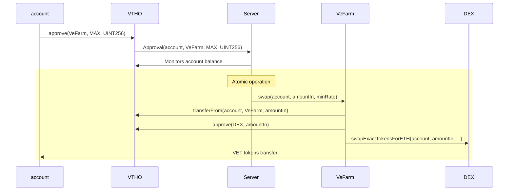

# VeChain General Grant Application Template

## Project Overview

- Project: Automatic VTHO to VET swaps using optimized strategies.
- Team Name: VeFarm
- Payment Address: `0x0eb13a68557d72f884Bb05df8872D4CcD85810b4`

> ⚠️ *The combination of your GitHub account submitting the application and the payment address above will be your unique identifier during the program. Please keep them safe.*

### Overview

**A brief description of the project.**

The goal of VeFarm is to develop an application that allows for automatic VTHO to VET token swaps on the VeChain network. Users will grant permission to the VeFarm contract to spend their VTHO, after which the contract will periodically withdraw funds from the user's account, perform a swap for VET tokens through a DEX, and return the resulting VET tokens back to the user's account, all in a single atomic operation. The aim is to devise an optimized strategy, based on a mathematical analysis, to time these swaps effectively, maximizing the user's rate of VET accumulation and VTHO generation.

**An indication of why your team is interested in creating this project within the VeChain Ecosystem.**

VeFarm takes advantage of the unique features of the VeChain two-token economic model, therefore is incompatible with other blockchain networks. Additionally, the team has experience developing apps within the VeChain ecosystem.

**If relevant, an indication of how you will integrate tools and features (e.g., Sync2/Connex, fee delegation protocols, MTT, etc) to enhance your project.**

During the initial phase of the project, our plan is to utilize fee delegation as a means to promote the app. Fee delegation can be enabled or disabled on specific occasions, but it is essential that the user bears the responsibility of paying the fees since this is a DeFi application.

The application will support Sync2 and VeWorld sign ins.

### Project Details

**Project architecture**

Below is a list of the key components involved in the VeFarm project, including the user interface, backend API, and smart contracts for VeFarm, VTHO, and DEX.

- Front End: The user-facing interface where users can interact with the VeFarm application, such as logging in, granting/revoking permission, viewing their account balance and past transactions.
- VeFarm API (Backend): The backend API responsible for processing user requests, interacting with smart contracts, and executing essential business logic. This includes tasks like monitoring account balances, optimizing swap timing, initiating trades and storing relevant data.
- VeFarm Smart Contract: The smart contract responsible for initiating token swaps, and handling interactions with the VTHO and DEX contracts.
- VTHO Smart Contract: The smart contract that manages the VTHO token.
- DEX Smart Contract: The smart contract representing the decentralized exchange where the token swaps are executed (based on Uniswap V2).

**Blockchain Level Interaction Flow**

The following diagram illustrates the interaction flow within the VeFarm project at the blockchain level. This involves various entities such as the user's account, the VeFarm smart contract, the VTHO and DEX smart contracts, and the VeFarm server.

The trade process involves several steps. To begin, the user's account invokes the `approve` method on the VTHO contract, granting the VeFarm contract permission to spend their tokens. Following this, the server detects the `Approval` event emitted by the VTHO contract and starts monitoring the user's account balance to determine the optimal trade timing.

Once the server identifies the right moment, it triggers the `swap` function on the VeFarm contract, initiating the trade by specifying the target account and the withdrawal amount. In response, the VeFarm contract transfers the user's token balance to its own account and provides approval to the DEX contract for spending a specific amount of VTHO tokens. With the necessary authorizations and transfers in place, the VeFarm contract calls the `swapExactTokensForETH` function on the DEX contract to kickstart the swap. This function invocation directs the VET tokens to be transferred from the DEX contract to the target account, effectively completing the trade process.

<!--
- https://changelly.com/exchange/vtho/vet
- https://wise.com/nz/
-->

**Technology Stack**

- Svelte: The aim is to avoid the use of a backend framework like Next.js and keep the application as a compact JavaScript bundle that can be stored on a CDN or IPFS.
- Solidity.
- Hardhat.
- Firebase: Utilizing Node.js together with serverless architecture, and Firestore, a NoSQL database for data storage.
- Rust / C++: Depending on the performance requirements, we may choose to implement the mathematical algorithm using a low-level programming language.
- REST.
- TypeScript.
- Netlify: Hosting provider.

**POC**

We have a working POC of the product on testnet [https://main--symphonious-macaron-41163f.netlify.app/](https://main--symphonious-macaron-41163f.netlify.app/).

### Ecosystem Fit

**Are there any other projects similar to yours? If so, how is your project different?**

We are not aware of any existing projects with the exact same functionality. However, we did find a related strategy in a [medium article by favo](https://blog.VeChain.energy/how-to-swap-tokens-in-a-contract-c82082024aed) that involves regular token swaps using the vechain.energy infrastructure. In contrast, VeFarm aims to develop a mathematical algorithm for creating a more efficient swap timing strategy, rather than relying on fixed time intervals. Additionally, our project offers universal access to this functionality, enabling any user to benefit.

## Team

### Team members

- Federico Rodes

### Team Website

- https://github.com/VeFarm

### Team's experience

**Federico Rodes**, with over 7 years of experience as a Full Stack Web Developer, holds a Master's degree in Applied Mathematics. His primary focus since 2020 has been on blockchain technology. He is well-versed in various technologies, including React.js, Svelte, Node.js, Serverless, TypeScript, Solidity, and Hardhat, among others. In the past, he conducted research on [Algorithms for solving Integer Linear Programming problems](https://arxiv.org/abs/1404.3965), although it is not directly related to the VeFarm project.

### Team Code Repos

[Federico Rodes Github](https://github.com/fede-rodes)

### Team LinkedIn Profiles

[Federico Rodes Linkedin](https://www.linkedin.com/in/federico-rodes-4b2602113/)

## Development Roadmap

#### Overview

|  | Milestone 1 | Milestone 2 | Milestone 3 | Total |
| - | - |- | - | - |
| Estimated Duration | 30 d | 60 d | 30 d | 120d |
| Full-time equivalent (FTE) | 1 | 0.5 | 0.5 | 2 |
| Cost (up to $ 30,000) | $ 5,000 (done) | $ 5,000 | $ 2,500 | $ 12,500 |

#### Milestone 1 — POC

| Number | Deliverable | Specification |
|-|-|-|
| 0 | Smart Contract | Create a non-upgradable smart contract that provides a `swap` function. The function will require the following parameters: `account` (payable address - target account), `amountIn` (uint256 - VTHO amount to be swapped), and `minRate` (uint256 - minimum accepted exchange rate). When invoked, the smart contract will transfer VTHO tokens from the user's balance to the contract's balance. It will then approve the DEX contract to spend the specified amount of tokens (no fees will be deducted in this milestone). Finally, the contract will call the `swapExactTokensForETH` function on the DEX contract to perform the swap, with the target account as the destination address. After the trade is completed, the contract will emit a `Swap` event to log relevant information, including the `account`, `amountIn`, and `amountOut` (uint256 - VET amount received after the swap). It is worth mentioning that the contract is designed to be non-custodial, ensuring that users' funds stay in their accounts until the swap function is executed. |
| 1 | Backend | Develop a backend service to periodically retrieve the `Approval` events emitted by the VTHO contract. This service will store the accounts that have approved the VeFarm contract for token spending. For these approved accounts, implement a job that periodically fetches the account balance and triggers the `swap` function on the VeFarm contract based on a simple strategy: whenever the user's balance reaches 5 VTHO (keeping the `minRate` constant). The backend service will listen to the `Swap` events emitted by the VeFarm contract after the trade is completed and store relevant information in the database, including the VTHO input amount, VET output amount, and transaction ID. Track basic statistics such as the total number of accounts, transaction count, and the amounts of VTHO and VET being swapped. Additionally, provide an endpoint to query the statistics and retrieve the list of transactions associated with a specific account. |
| 2 | Front End | Build a basic front-end interface that allows users to log in, view their current balance, authorize the VeFarm contract to spend their VTHO tokens, revoke approval, and access a list of past transactions. |

#### Milestone 2 — MVP

| Number | Deliverable | Specification |
|-|-|-|
| 0a. | Documentation | Provide comprehensive inline documentation of the code and create a basic tutorial that demonstrates interaction with the deployed smart contract. |
| 0b. | Testing Guide | Ensure proper unit test coverage (e.g., 90%) for the code functionality and robustness. Document the steps to run these tests in a testing guide. |
| 1 | Smart Contract | Build upon the Milestone 1 specifications. Restrict the access to the `swap` function to the contract's owner and likely some admin accounts (TBD). Integrate a list of accessible DEXs for trading, with immutable addresses set during contract initialization. Introduce a `dexId` parameter to the `swap` function, enabling the selection of a specific DEX for the swap. Upon function call, we deduct transaction fees and the protocol fee (0.3%), and then swap the remaining amount for VET, sending it directly to the user's account. Enable the contract owner to withdraw accumulated fees. |
| 2 | Backend | Build upon the Milestone 1 specifications. Develop an algorithm to optimize the swap timing based on market conditions and account balance. It should outperform a fix time interval swap strategy. Compute the `minRate` parameter passed to the swap function based on an external price feed and DEX's liquidity. Implement fee delegation to prepare for the application's launch. |
| 3 | Front End | Build upon the Milestone 1 specifications. Hire a designer to enhance the front-end interface aesthetics and UX. Add an input field for users to specify the minimum amount of VTHO they wish to retain in their account after the swap. |
| 4 | Community | Make the application available for users to try on the testnet and actively gather feedback from the community. |

#### Milestone 3  —  Mainnet Version

| Number | Deliverable | Specification |
|-|-|-|
| 0a.| License | MIT(*) |
| 0b. | Documentation | Provide comprehensive inline documentation of the code and create a basic tutorial that demonstrates interaction with the deployed smart contract. |
| 0c. | Testing Guide | Ensure proper unit test coverage (e.g., 90%) for the code functionality and robustness. Document the steps to run these tests in a testing guide. |
| 0d. | User Guide | Prepare a user guide or demo video showcasing the implemented features as well as a Gitbook. |
| 1 | Smart Contracts | Enhance the VeFarm smart contract based on feedback received in the previous phase. Deploy the contract to the mainnet and conduct real-world testing before launch. Open source the smart contract and upload the ABI to the B32 repository. [B32](https://github.com/VeChain/b32). |
| 2 | Backend | Update the swap algorithm and overall backend architecture and infrastructure based on insights gained in the previous stage. Deploy a production environment and enable fee delegation functionality. |
| 3 | Front End | Align with backend updates. Improve the frontend interface and user experience accordingly. |
| 4 | Community | Engage with the community and launch the application into production. Gather feedback and promptly address any identified issues.|

(*) The VeFarm smart contract will be open source, while the frontend and backend will remain closed source.

#### Community engagement

We understand the importance of community engagement and outreach. As part of our commitment, we will produce and publish at least one article or tutorial on Medium, which will detail the progress and achievements of our project as a grant requirement. This article aims to help users comprehend the value and usage of the VeFarm app in the VeChain ecosystem. Furthermore, during the testing and development phase, we plan to actively grow the community, gather user feedback, and make necessary improvements to the product.

## Future Plans

We intend to keep the project up-to-date and make necessary updates, while periodically reaching out to the community to gather feedback and make improvements accordingly.

Ideally, this project will be the first of many farms in the VeChain ecosystem, paving the way for future developments.

