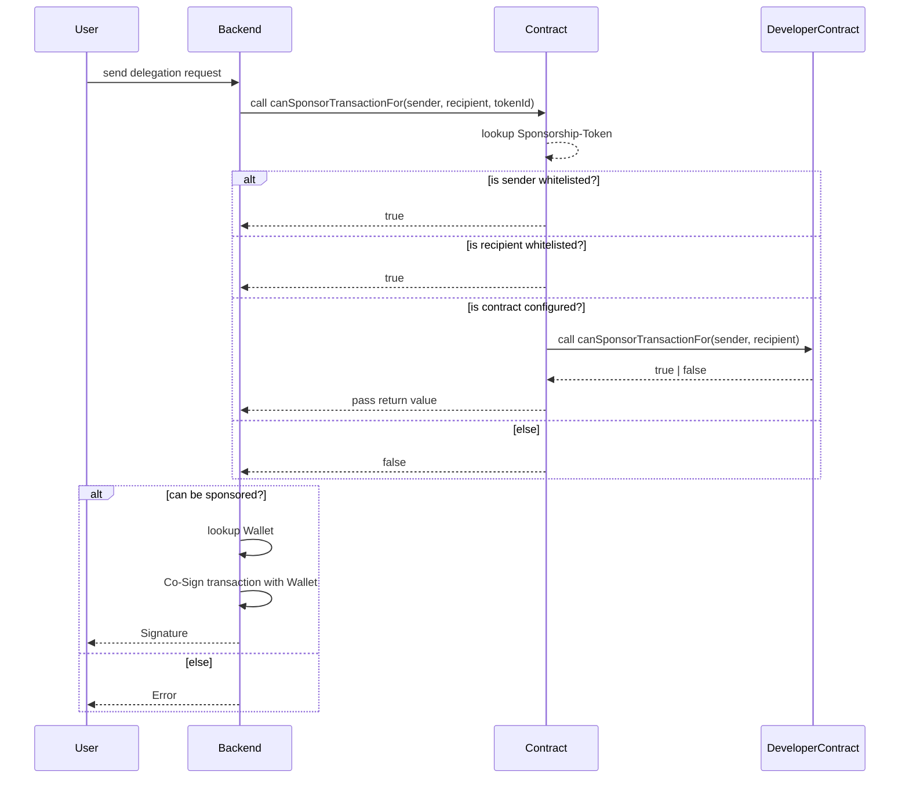

# VeChain General Grant Application Template

## Project Overview 

- Project: vechain.energy
- Team Name: favo
- Payment Address: `0xcC4B3412161Ea88d0538D2Da15cffa74af0eE9D4`

### Overview

vechain.energy aims to provide an easy to use service fee delegation service. The typical web-user can not handle crypto tokens or wallets, requiring them to have VTHO for transactions adds an unnecessary burden on the user and limits plattforms to users that are able to acquire VTHO.

vechain.energy will provide a signing service that is managed by owners of dApps to empower a new kind of dApp that does not put the crypto-know-how on their users shoulders.

vechain.energy will also help developers to focus on their projects by removing VTHO distractions (faucet, VTHO sharing).

### Project Details

**Signing-Diagram**

#### Smart-Contract

Sponsorships are created as Tokens (NFT, ERC721). The parameters required to accept a transaction for fee delegation are configured within the Tokens.

At first a validation will be performed with three parameters:

1. Origins can be whitelisted (like Users or Wallets)
1. Recipients can be whitelisted (like Contracts)
1. Contracts can be configured and called to verify each request
    * `function canSponsorTransactionFor(address _sender, address _recipient) public view returns (bool) {}`

#### Web-Application

A web application (React) will manage the Sponsorships and their parameters. The application supports Sync2 and social sign ins with non-custodial key management (https://web3auth.io)

A good documentation and code-snippets are found on the website to make it as easy as possible for users to use the service.

Screenshot of a Sponsorship-Page:

#### Signing-Service

The signing service (NodeJS) will generate a wallet for every Sponsorship and use it for co-signing allowed transactions.
Delegation requests will be verified in the Smart Contract and then co-signed with the managed wallets.

The service will be deployed on AWS.

### Ecosystem Fit

There is no other known service in the ecosystem. Yet this is what makes VeChain unique for developers and enterprises closing the gap between web2 and web3.

* It will allow more developers to provide applications that hide away the crypto-know-how.
* Simplify contract development & deployments by using a delegation instead of funding each developers address
* Allow developers/companies to share VTHO without sending it to each other
* Developers can start developing applications on the TestNet just by adding a delegateUrl to their transaction requests

## Team 

### Team members

- I am a fulltime IT-professional for 24 years with focus web- and mobile applications, I ran two companies and during covid decided to switch fully into web3. I am happy to share more details by email (instead of publishing it on GitHub).

### Team Website

- https://testnet.vechain.energy
- Personal: https://favo.org/ + https://blog.favo.org/

### Team's experience

* 24 Years of development experience, team management and company management
* Experience in solidity has been obtained during the past two years
* Heavily driven by Test-Driven-Development

## Development Roadmap 

#### Overview

Originally the Roadmap was split into three parts but since development is already progressed, it will be reduced to one milestone for the complete application:

|  | Full Application | Infrastructure | Total |
| - | -: | -: | -: |
| Estimated Duration | 45d | 1d | 46d |
| Full-time equivalent (FTE) | 1 | 1 | 1 |
| Cost (up to $ 30,000) | $24,000 | $6.000 | $24,000|

#### Milestone 1 — Full Application

| Number | Deliverable | Specification |
|-|-|-|
| 1 | Contract: NFT-Contract | Create Sponsorships as NFT with full ERC/VIP Support|
| 2 | Contract: Token-Configuration | Ability to configuration signing-parameters in the tokens |
| 3 | Contract: Signing-Confirmation | Confirm Signing within the contract (incl. calling reference contracts if signing is supported) |
| 4 | Backend: Wallet | Backend Wallet Management for each Token |
| 5 | Backend: Signing-Confirmation | Verify transaction against Contract |
| 6 | Backend: Signing | Co-Signing of transactions |
| 7 | Backend: Withdraw | Ability to withdraw funds from managed wallets |
| 8 | Website: Deployment | Application is available on AWS with Test- and MainNet Connectivity |
| 9 | Website: Session | Sign-Up/Sign-In (Sync2 + Social Sign-In) on the Website |
| 10 | Website: Management | Full Management of Sponsorships using the Web-Applicaation |
| 11 | Website: Documentation | Example-Codes and Support to use the service in different environments |

* All contract and backend related deliverables will be prove by a unit test reports
* The website related deliverables will be proven by a link to the website and screenshots

#### Milestone 2 — Infrastructure

The $6,000 will be used to:

1. pay server costs for 12 months (ca. $1,440)
1. purchase VTHO from the market to sponsor transactions on the MainNet (Community-Projects)

#### Community engagement

An article about the service and/or a tutorial on how to use it will be published on medium. Reference to the grant will be included.

## Future Plans

After the initial Milestones on this roadmap the development will be shaped by the feedback from its users and experience acquired during development. There are several ideas on cost Management/Rate Limiting, accessing transactions details or having a calculator to estimate future costs.

To support the community (and as marketing instrument) vechain.energy will also:

1. Provide an open Sponsorship on all TestNet-Transactions to help new applications start faster
1. VTHO will be purchased on the MainNet to sponsor applications or users that are interested in its service (Wallets, Exchanges, NFT Plattforms other Applications)

Some ideas for the future are:

1. A trustee contract to deposit VET that generates VTHO which is accessible from vechain.energy while the VET is only accessible by its owner
1. Providing logging/analytics services for sponsored transactions

## Additional Information 

A initial MVP was setup during 2021 as a test application and to learn about the requirements. Since then it served myself well on testing new applications on VeChain and lowered the entry-barrier for team-mates joining developing projects.

A production ready prototype is already being developed and tested with a real-world-application that will launch during Q2/2022. The grant was planned to be put up at the beginning of the development. The first prototype on the MainNet will be live in Q2/2022 as well.
