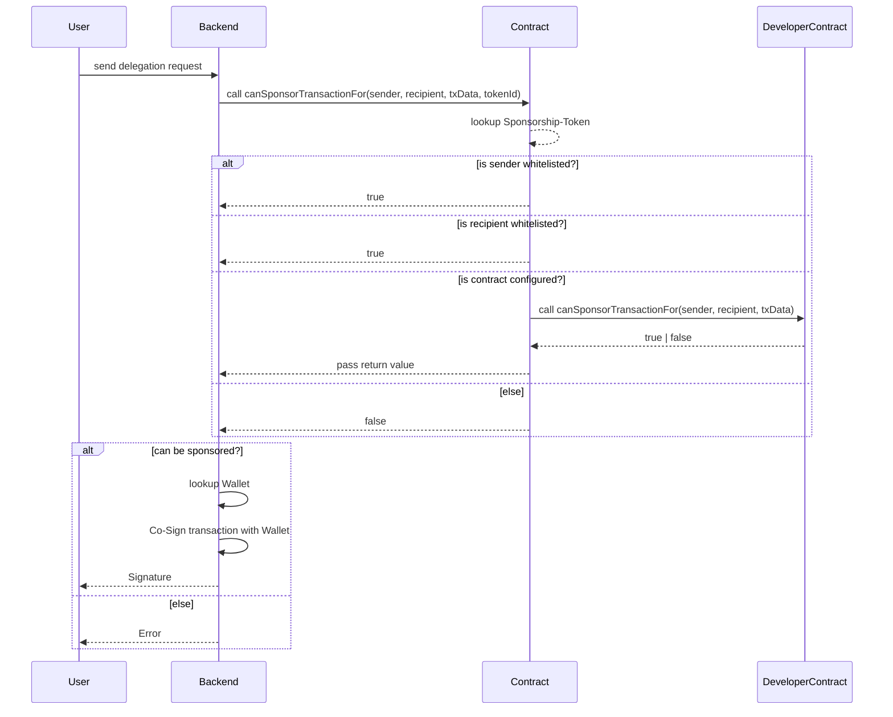

# VeChain General Grant Application Template

## Project Overview 

- Project: vechain.energy
- Team Name: favo
- Payment Address: `0xcC4B3412161Ea88d0538D2Da15cffa74af0eE9D4`

### Overview

vechain.energy aims to provide an easy to use service fee delegation service. The typical web-user can not handle crypto tokens or wallets, requiring them to have VTHO for transactions adds an unnecessary burden on the user and limits plattforms to users that are able to acquire VTHO.

vechain.energy will provide a signing service that is managed by owners of dApps to empower a new kind of dApp that does not put the crypto-know-how on their users shoulders.

vechain.energy will also help developers to focus on their projects by removing VTHO distractions (faucet, VTHO sharing).

### Project Details

**Signing-Diagram**

#### Smart-Contract

Sponsorships are created as Tokens (NFT, ERC721). The parameters required to accept a transaction for fee delegation are configured within the Tokens.

At first a validation will be performed with three parameters:

1. Origins can be whitelisted (like Users or Wallets)
1. Recipients can be whitelisted (like Contracts)
1. Contracts can be configured and called to verify each request
    * `function canSponsorTransactionFor(address _sender, address _recipient, bytes calldata _data) public view returns (bool) {}`

#### Web-Application

A web application (React) will manage the Sponsorships and their parameters. The application supports Sync2 and social sign ins with non-custodial key management (https://web3auth.io)

A good documentation and code-snippets are found on the website to make it as easy as possible for users to use the service.

Screenshot of a Sponsorship-Page:

#### Signing-Service

The signing service (NodeJS) will generate a wallet for every Sponsorship and use it for co-signing allowed transactions.
Delegation requests will be verified in the Smart Contract and then co-signed with the managed wallets.

The service will be deployed on AWS.

### Ecosystem Fit

There is no other known service in the ecosystem. Yet this is what makes VeChain unique for developers and enterprises closing the gap between web2 and web3.

* It will allow more developers to provide applications that hide away the crypto-know-how.
* Simplify contract development & deployments by using a delegation instead of funding each developers address
* Allow developers/companies to share VTHO without sending it to each other
* Developers can start developing applications on the TestNet just by adding a delegateUrl to their transaction requests

## Team 

### Team members

- I am a fulltime IT-professional for 24 years with focus web- and mobile applications, I ran two companies and during covid decided to switch fully into web3. I am happy to share more details by email (instead of publishing it on GitHub).

### Team Website

- https://testnet.vechain.energy
- Personal: https://favo.org/ + https://blog.favo.org/

### Team's experience

* 24 Years of development experience, team management and company management
* Experience in solidity has been obtained during the past two years
* Heavily driven by Test-Driven-Development

## Development Roadmap 

#### Overview

|  | Contract | Backend | Website | Release + Maintenance | Infrastructure | Total |
| - | -: | -: | -: | -: | -: | -: |
| Estimated Duration | 9d | 10d | 18d | 8d | 1d | 46d |
| Full-time equivalent (FTE) | 1 | 1 | 1 | 1 | 1 | 1 |
| Cost (up to $ 30,000) | $4,770 | $5,300 | $9,540 | $4,240 | $6.000 | $29,850 |

Development costs are based on a daily rate of $530 per developer (€470) for a regular work day.  
My personal regular rates for clients are normally double at €960.

The total costs of the project is higher, not in this grant is already planned work that will improve the project further:

1. Developing Enterprise-Features for 
   1. Analytics
   1. Integrate Fiat-On-Ramp incl. Accounting to support on-boarding of businesses
   1. Automatic VET/VeUSD to VTHO conversion (using a DEX)
   1. Ability to trigger Webhooks on events (i.e. calling an API when an event is emitted)
1. Creating (little) helpers as show cases and to help community, i.e.
   1. Wallet sweeper to clear own wallet without leaving anything behind
   1. VTHO Analytics for Contract-Usage
   1. Trustee-Contract to share VTHO but remain in control of VET
1. Writing Articles for Developer-Support, as well supporting Developers to use the Service and implement the fee delegation and improving Documentation over time
1. Bugfixes and Improving the Plattform with Requests that occur after launch
1. Networking to plattforms and handling the MainNet Sponsorship-Relationships

The continuing development of the plattform is personal investment into the project and the future.

#### Milestone 1 — Contract

| Number | Deliverable | Specification |
|-|-|-|
| 1.0 | Setup | Setup Project including a CI/CD-Pipeline that auto-deploys to Test- and MainNet after running Unit-Tests |
| 1.1 | NFT-Contract | Create Sponsorships as NFT with full ERC/VIP Support|
| 1.2 | Token-Configuration | Add functionality to ability to configuration signing-parameters in the tokens |
| 1.3 | Signing-Confirmation | Confirm Signing within the contract (incl. calling reference contracts if signing is supported) |
| 1.4 | Deposit / Withdraw | Ability to deposit and withdraw VET/VTHO linked to a Token |
| 1.5 | Key/Value-Store | Ability to store configuration values without upgrading the contract (EIP-725) |
| 1.6 | Self-Init | Automatically self-init contract to sponsor itself with the first sponsorship |
| 1.7 | Versioning | Tokens can be linked and verificiation run with different contract variants/versions to support new and different features over time |
| 1.8 | Example-Snippets | Write examples and documentation for other developers to implement the interface for contract interaction |

* Deliverables will be proven by hardhat jest unit tests and a Markdown-Document with Code-Snippets.

#### Milestone 2 — Backend

| Number | Deliverable | Specification |
|-|-|-|
| 2.0 | Setup | Setup Project including a CI/CD-Pipeline that auto-deploys to Staging, Development and Production URLs |
| 2.1 | Wallet | Wallet Management for each Token to use for Co-Signing |
| 2.2 | Signing-Confirmation | Verify Requests against Contract |
| 2.3 | Co-Signing | Co-Signing of transactions using the Wallet for each Token |
| 2.4 | Pre-Check | Allow to pre-validate a transaction before submitting it for Co-Signing |
| 2.5 | Deposit / Withdraw | Ability to handle VET/VTHO deposits and withdraw the funds from the managed wallets |
| 2.6 | Logging | Logging of signing requests (without IP-Address by default) linked to each Token and automatic deletion |
| 2.7 | Sessions | An Auth-Workflow that handles web3auth and Sync2 as Session-Management (by issueing a Token that is signed by the user and verified on subsequent requests)
| 2.8 | Log-Access | Provide access to Logs with a filter and query parameters and the ability to download |

* Deliverables will be proven by jest unit tests.

#### Milestone 3 — Website

| Number | Deliverable | Specification |
|-|-|-|
| 3.0 | Setup | Setup Project including a CI/CD-Pipeline that auto-deploys to Staging, Development and Production URLs |
| 3.1 | User: web3auth | Implement a Social Sign-In with web3auth to offer non-Sync-Users access |
| 3.2 | User: Sync2 | Sign-In with Sync2  |
| 3.3 | Create Sponsorships | Ability to create new Sponsorships |
| 3.4 | List Sponsorships | List Sponsorships with a Overview of relevant key information |
| 3.5 | View Sponsorships | Access information of Sponsorships with current Balance, last Requests/Errors (Logs)  |
| 3.6 | Modify Sponsorships | Change basic Sponsorship-Information (Title, toggle Logging) and configuration (sender, recipient, contracts) incl. validation of the entered data (i.e. does the given contract support the required function) |
| 3.7 | Deposit | Instruct and help user to deposit VET/VTHO to the Sponsorship |
| 3.8 | Withdraw | Ability to Withdraw |
| 3.9 | Wallet | Add the ability for Social Users (web3auth) to send their balance to other wallets |
| 3.10 | Delete Sponsorships | Burning Sponsorships including automatic Withdraw |
| 3.11 | Documentation Usage | Example-Codes and Support to use the service in different environments and languages |
| 3.12 | Documentation Verification | Example-Codes and Support to verify transactions within contracts (for example decoding data to verify token data in a transaction) |

* The website related deliverables will be proven by a link to the website and screenshots

#### Milestone 4 — Release + Maintenance

| Number | Deliverable | Specification |
|-|-|-|
| 4.1 | TestNet-Sponsorship | Instructions/Documentation using the TestNet Sponsorship (for dApps or Deployments) |
| 4.2 | MainNet-Sponsorship | Section with Instructions/Documentation and contact to request whitelisting for the Sponsorship-Pool |
| 4.3 | Setup Socials | Twitter, Discord and Medium-Profil will be setup and filled with launch information |
| 4.4 | Publication | Deploying MainNet Contract, Backend and Website to Production URLs |
| 4.5 | Maintenance | Application Support/Maintenance during the first Year |

* Release and Setting up the social networks is expected to require less than two days
* For the first year maintaining the infrastructure and adjust the application for small issues is expected to require at least 1 hour / week (6 days/year)
   * Additional time is not covered by the grant and personal investment
* The deliverables will be proven by a link to each instance.
* _During this Milestone a MainNet-Deployment and official availability will take place._

#### Milestone 5 — Infrastructure

The $6,000 will be used to:

1. pay server costs for 12 months (ca. $1,440), monthly circa based on:
   1. 5x Instances for two Setups and Staging
      1. 1x Backend for TestNet ($21)
      1. 1x Backend for MainNet ($21)
      1. 1x RDS ($27)
      1. 1x ElastiCache  ($14)
      1. 1x Backend for Staging/Testing-Purpose ($21)
   1. other AWS Costs of circa $16 (Traffic, Lambda, CloudFront, S3-Storage, RDS-Snapshots, Docker-Registry, etc.)
1. $4,560 purchase VTHO from the market to sponsor transactions on the MainNet (Community-Projects)
   1. The sponsorship is a marketing instrument and the expected VTHO Pool of 1.300.000 (current price levels) will last for circa 650.000 transactions of 2 VTHO (a VeXchange trade costs about 1,3 VTHO) that should last a whole year
   1. The VTHO Pool is also used to Sponsor interaction with vechain.energy
   1. As soon as income is generated (see business model), 10% of it will be used to purchase VTHO or VET (to generate VTHO) to replenish the pool

With growing interest the infrastructure will change to better support scaling by moving Backends into Lambda@Edge-Functions and setting up an own VeChain-Node. This isn't done in the beginning to simplify the setup and keep it flexible for change.

#### Community engagement

* An article about the service and/or a tutorial on how to use it will be published on medium. Reference to the grant will be included
* Medium will be used to write multiple articles on how to use the service and the delegation functionality
* A Twitter-Account will be used for sharing updates and relevant news
* A Discord-Server will be setup for developer support and generic development help spanning the all areas (not just fee delegation)

## Future Plans

After the initial Milestones on this roadmap the development will be shaped by the feedback from its users and experience acquired during development. There are several ideas on cost Management/Rate Limiting, accessing transactions details or having a calculator to estimate future costs.

To support the community (and as marketing instrument) vechain.energy will also:

1. Provide an open Sponsorship on all TestNet-Transactions to help new applications start faster
1. VTHO will be purchased on the MainNet to sponsor applications or users that are interested in its service (Wallets, Exchanges, NFT Plattforms other Applications)

### Business Model

* The basic functionality of the platform will stay free of charge.
* Server costs after the first year or additional costs that occur will be covered personally.
* An enterprises access will be created to allow insight into their application users through their transactions.
* The enterpise access will be priced lower than the costs for running and maintaining a services themself.
   * Experience in the industry puts that fee at $20-$60 (for small to medium business). Payable by PayPal or VeUSD.

Enterprise access additional features will be:

1. Searchable and downloadable persistent logging of sponsoring requests
1. The logging is extended with user data that is available thru http-connections (ip, geo-location or custom data)
1. Enterprises can also use fiat to fill their VTHO-Pool to simplify "charging" their transactions by using Fiat-payments in advance.
    * The On-Ramp will be made available using simplex and hopefully VeUSD will have a good gateway.
1. Automatic VTHO purchase from VeUSD deposits using VeXchange or VeRocket
1. Configure Webhooks on events (i.e. calling an API when an event is emitted)
1. Ability to Rate-Limiting Sponsorships
1. With only 10 customers paying $20 / month the project will already be sustainable
   1. At least two companies are already interested in the service.
1. At least 10% of the income (after deducting server costs) will be used to purchase VET/VTHO to replenish the free sponsoring pool for community projects/developers to keep the marketing pool replenished

To show our gratitude towards VeChain and the grant, X-Node-Owners will receive free enterprise access.

## Additional Information 

A initial MVP was setup during 2021 as a test application and to learn about the requirements. Since then it served myself well on testing new applications on VeChain and lowered the entry-barrier for team-mates joining developing projects.

A production ready prototype is already being developed and tested with a real-world-application that will launch during Q2/2022. The grant was planned to be put up at the beginning of the development. The first prototype on the MainNet will be live in Q2/2022 as well.
